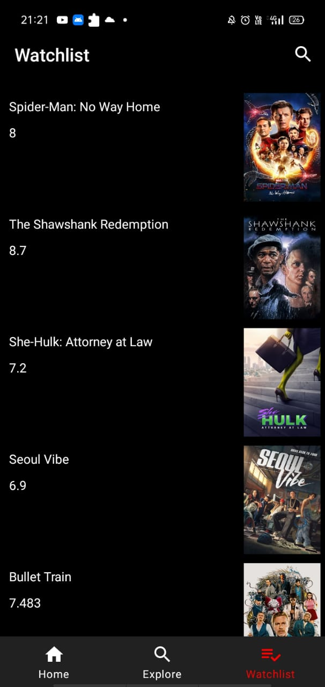

# Movie_App
## IMAGES
Tried to build a clone of Google PLAY-MOVIES App

## DESCRIPTION
It is a sample movie application built wiht the purpose of exploring android best practices and libraries.
Users can save movies to their watchlist.Built with Kotlin using MVVM architecture.
## LIBRARIES USED
+ RETROFIT 
+ GSON
+ ROOM
+ PICASSO
+ HILT
## FEATURES
+ Trending Movies
+ Popular Movies
+ HighRated Movies
+ Add to Watchlist 

